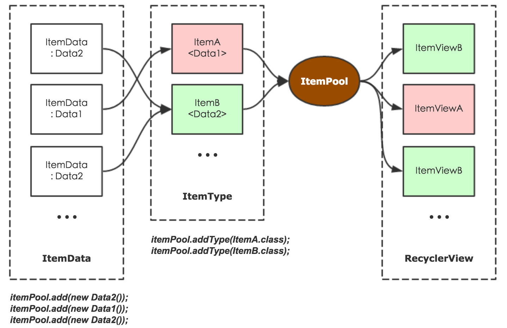

# ItemPool
[](http://www.apache.org/licenses/LICENSE-2.0.html) [](https://jitpack.io/#nekocode/ItemPool)

Decouple the item(/nested viewholder) from recyclerview's adapter. 

Reuse itemview in every recyclerview.



## Install

```gradle
repositories {
    maven { url "https://jitpack.io" }
}
dependencies {
    compile 'com.github.nekocode:ItemPool:{lastest-version}'
}
```

## Comparison

|     | ItemPool | Adapter |
| :-- | :------: | :-----: |
| Write `Adapter`’s boilerplate code | No | Yes |
| Maintain an extra data list | No | Yes |
| Reuse item view in other RecyclerView | Very easy | Difficult |
| Handle view events | Easy | Difficult |

## Usage

Firstly, create a new `Item` (It's a bit similar to the `ViewHolder`). Override the `onCreateItemView()` method to create the view for this item. And override the `onBindData()` method for binding the corresponding type (the generic type of the class) of data to the item view.

```java
public class TextItem extends Item<String> {
    private TextView textView;

    @NonNull
    @Override
    public View onCreateItemView(@NonNull LayoutInflater inflater, @NonNull ViewGroup parent) {
        final View itemView = inflater.inflate(R.layout.item_test, parent, false);
        textView = (TextView) itemView.findViewById(R.id.textView);
        return itemView;
    }

    @Override
    public void onBindData(@NonNull String s) {
        textView.setText(s);
    }
}
```

And then obtain an `ItemPool` instance. It extends the `ArrayList<Object>` so you can add any data object to it. And for telling the itempool which `Item` will show in the recyclerview, you need to add classes of items.

```java
ItemPool itemPool = new ItemPool();
itemPool.addType(HeaderItem.class);
itemPool.addType(TextItem.class);

itemPool.add(new Header());
itemPool.add("A");
itemPool.add("B");
```

Set the internal adapter of the itempool to the recyclerview.

```java
recyclerView.setAdapter(itemPool.getAdapter());
```

The itempool just like a mixture of data list and adapter because it has the `notifyXXX()` methods for refreshing the recyclerview.

```java
itemPool.notifyDataSetChanged();
```

**That's all! You don't need create `Adapter` any more! And every `Item` you create can be reused in any new recyclerview!**

### Handle view event

If you want to handle the item's view events. You can set an `ItemEventHandler` for a `Item`:

```java
itemPool.onEvent(HeaderItem.class, new ItemEventHandler() {
    @Override
    public void onEvent(@NonNull ItemEvent event) {
        switch (event.getAction()) {
            case Item.EVENT_ITEM_CLICK:
                Toast.makeText(MainActivity.this,
                        "You just clicked the header.", Toast.LENGTH_SHORT).show();
                break;

            case HeaderItem.EVENT_TEXT_CLICK:
                Toast.makeText(MainActivity.this,
                        "You just clicked the TextView.", Toast.LENGTH_SHORT).show();
                break;
        }
    }
});
```

It will trigger the `ItemEvent.ITEM_CLICK` events automatically. But you need to manually trigger other view events that you want to handle. For example:

```java
public class HeaderItem extends Item<Header> implements View.OnClickListener {
    public static final int EVENT_TEXT_CLICK = 1;

    private TextView textView;

    // ...

    @NonNull
    @Override
    public View onCreateItemView(@NonNull LayoutInflater inflater, @NonNull ViewGroup parent) {
        final View itemView = inflater.inflate(R.layout.item_test2, parent, false);
        textView = (TextView) itemView.findViewById(R.id.textView);
        textView.setOnClickListener(this);
        return itemView;
    }

    @Override
    public void onClick(View v) {
        if (v == textView) {
            event(EVENT_TEXT_CLICK, null);
        }
    }
}
```
